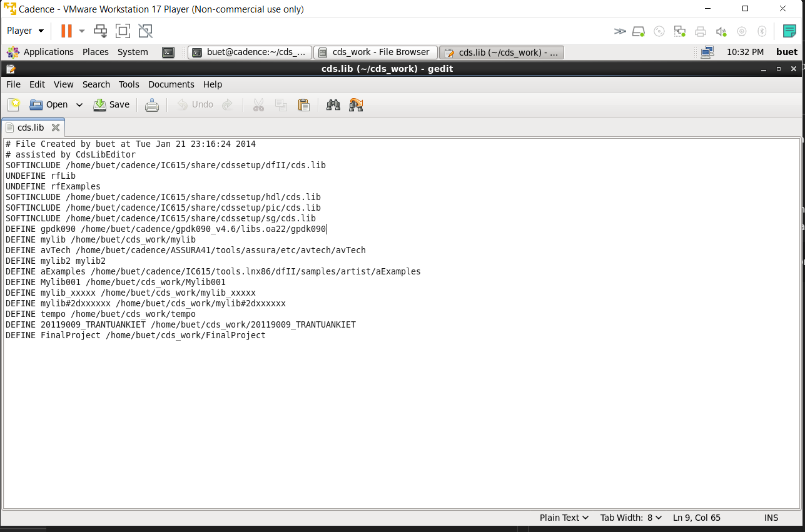
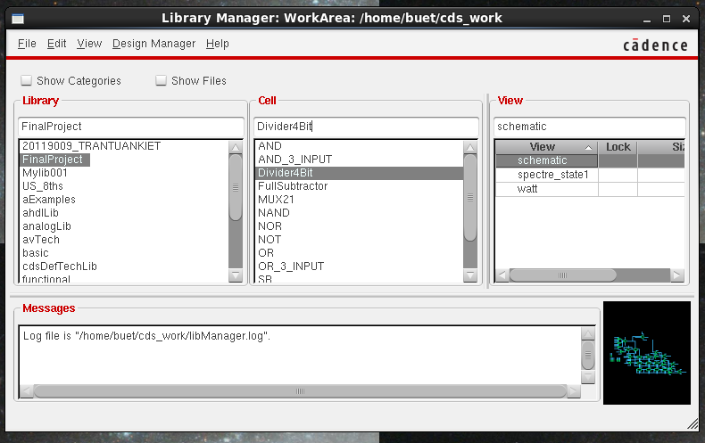
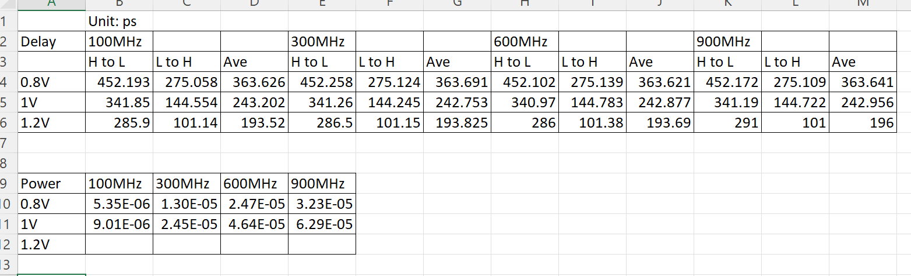
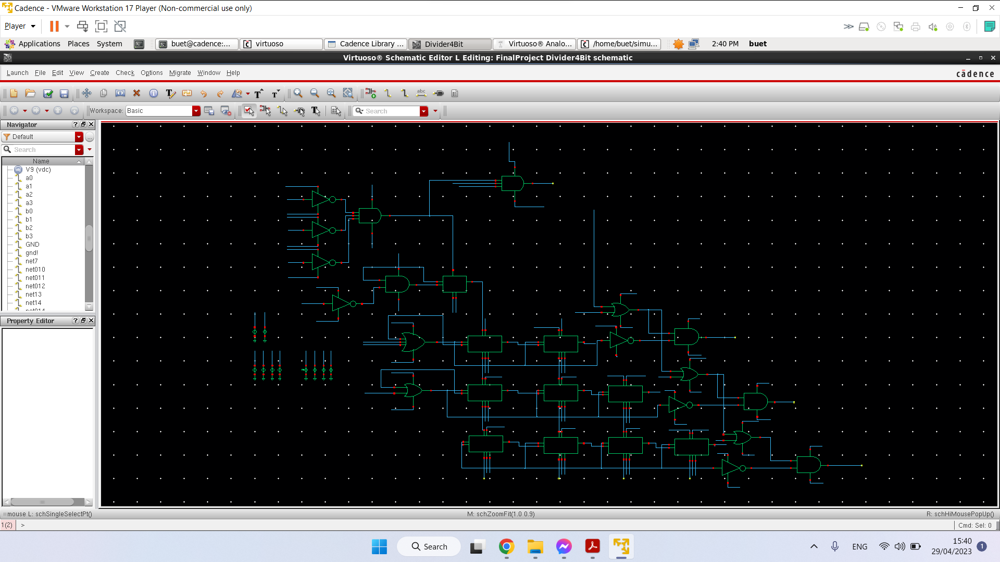
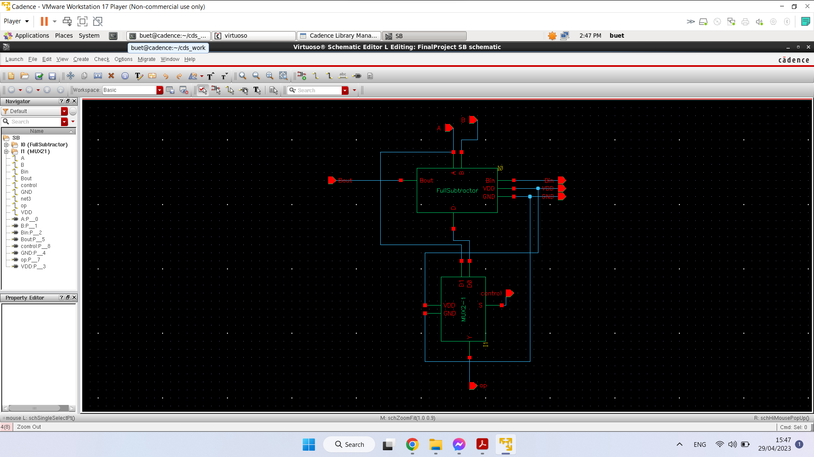

# Division-4-bit
Build a module 4 bit divider using 90nm technology - For learning purpose only

# How to use?

1. First, you need a Cadence Virtuoso version 6 and <b>gpdk90nm</b>, the technology file is very important!!!
2. Copy the whole folder /FinalProject to /home/(username)/cds_work/FinalProject
3. Open the File exprorer at dir /home/(username)/cds_work/FinalProject and update the file cds.lib by adding the line (as image below)
```
DEFINE FinalProject /home/buet/cds_work/FinalProject
```
</img>

# Run simulation

The final module is the Divider4Bit and you can run Spectre_state1 to see the waveform at normal condition<br>
And run the power if you want to measure the power



# Delay and power

Here is the delay and power statistic for my module



# Schematic and sub-module

The schematic for Divider 4 bit, with rectangle is a SB module



SB module:



# References:

I was get the digital schematic on this link: https://digitalsystemdesign.in/signed-array-divider/